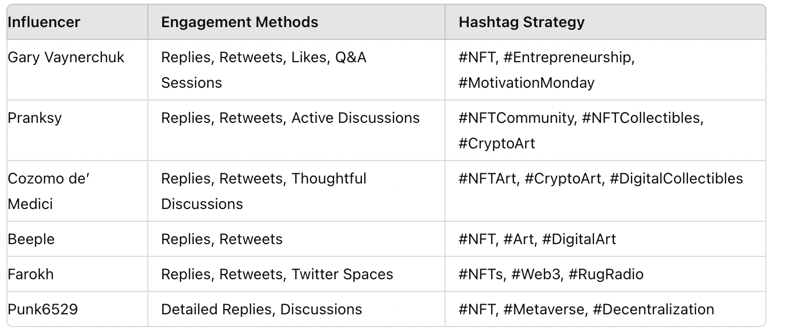
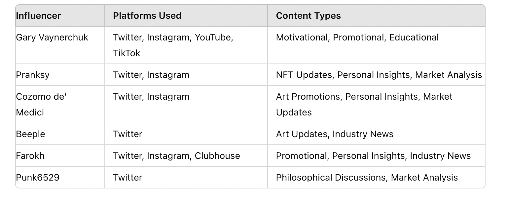

# NFT Influence Playbook: Lessons from 6 Web3 Giants

*Written by Yuantong Wu, Marketing Intern at The Confluence*

---

## Introduction

This report analyzes the social strategies of six influential figures in the NFT and Web3 space: Gary Vaynerchuk, Pranksy, Beeple, Cozomo de’ Medici, Farokh, and Punk6529. Drawing from their Twitter behaviors and content types, we extract insights that could help projects like Eternal Garden build stronger communities and brand identities.

---

## Influencer Analysis

### Gary Vaynerchuk (@garyvee)
- **Platforms:** Twitter, Instagram, YouTube, TikTok  
- **Content:** Motivational, Promotional, Educational  
- **Engagement:** Replies, Retweets, Likes, Q&A Sessions  
- **Hashtag Use:** #NFT, #Entrepreneurship, #MotivationMonday  
- **Insights:** Builds trust through authenticity, responds consistently, uses personal branding to drive NFT adoption.

---

### Pranksy (@pranksy)
- **Platforms:** Twitter, Instagram  
- **Content:** NFT Updates, Personal Insights, Market Analysis  
- **Engagement:** Replies, Retweets, Active Discussions  
- **Hashtag Use:** #NFTCommunity, #NFTCollectibles, #CryptoArt  
- **Insights:** Uses memes and giveaways to grow audience; less formal tone builds accessibility.

---

### Cozomo de’ Medici (@CozomoMedici)
- **Platforms:** Twitter, Instagram  
- **Content:** Art Promotions, Personal Insights, Market Updates  
- **Engagement:** Replies, Retweets, Thoughtful Discussions  
- **Hashtag Use:** #NFTArt, #CryptoArt, #DigitalCollectibles  
- **Insights:** Intellectual style with long-form threads attracts serious collectors.

---

### Beeple (@beeple)
- **Platforms:** Twitter  
- **Content:** Art Updates, Industry News  
- **Engagement:** Replies, Retweets  
- **Hashtag Use:** #NFT, #Art, #DigitalArt  
- **Insights:** Uses viral digital art and satire to dominate cultural conversations.

---

### Farokh (@farokh)
- **Platforms:** Twitter, Instagram, Clubhouse  
- **Content:** Promotional, Personal Insights, Industry News  
- **Engagement:** Replies, Retweets, Twitter Spaces  
- **Hashtag Use:** #NFTs, #Web3, #RugRadio  
- **Insights:** Builds brand via hosted media and cross-platform integration.

---

### Punk6529 (@punk6529)
- **Platforms:** Twitter  
- **Content:** Philosophical Discussions, Market Analysis  
- **Engagement:** Detailed Replies, Discussions  
- **Hashtag Use:** #NFT, #Metaverse, #Decentralization  
- **Insights:** Long threads with educational tone; blends ideology with strategy.

---

## Comparative Tables

### Engagement & Hashtag Strategy

### Platform & Content Style

---

## Strategic Takeaways for Eternal Garden

- **Consistency matters**: Frequent posting with a clear brand voice.
- **Education builds loyalty**: Threads and explainers attract longer-term engagement.
- **Persona-driven identity**: Create characters or founders with distinct online presence.
- **Community interaction**: Spaces, replies, and reposts help break hierarchy between creator and follower.
- **Visual & meme formats**: Lower the barrier of entry and create viral loops.

---

## Conclusion

This study reveals that successful NFT influencers balance substance, consistency, and style. For a brand like Eternal Garden, adopting storytelling-driven, human-centric communication will be key in establishing presence in the NFT space.

This article was originally produced in July 2024 during my internship at The Confluence and also published on their official blog.

